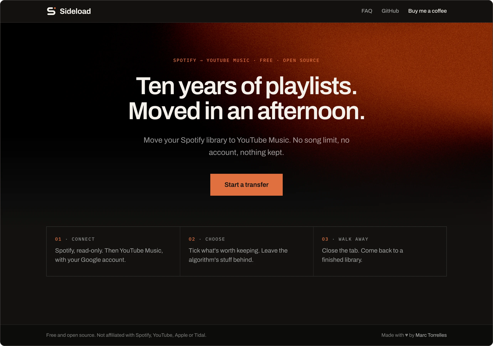
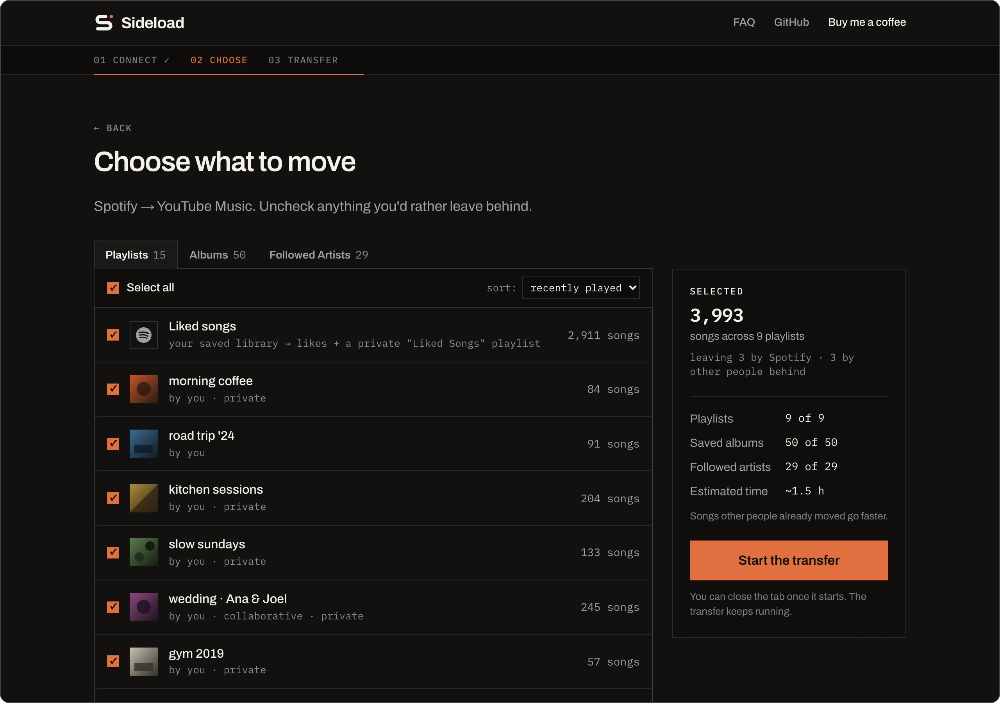
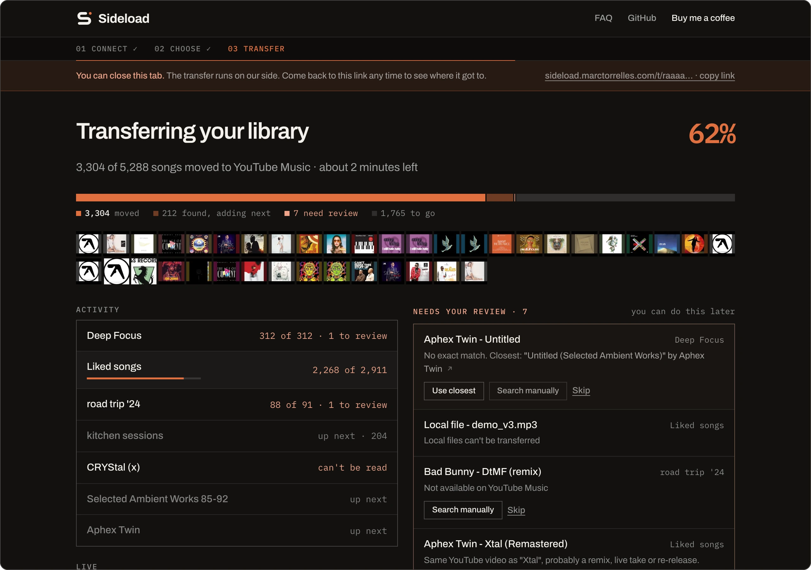

# Sideload

**Move your Spotify library to YouTube Music. Free, open source, nothing kept.**

Playlists, liked songs, saved albums, followed artists. Every add is read back and verified, and whatever YouTube Music does not have comes back to you as a list, not lost. No account, nothing to install: start it, close the tab, come back to a finished library.

**[sideload.marctorrelles.com](https://sideload.marctorrelles.com)** · [FAQ](https://sideload.marctorrelles.com/faq) · [Privacy](https://sideload.marctorrelles.com/privacy) · [Buy me a coffee](https://buymeacoffee.com/marctorrelles)

## How it works

**01 · Connect.** Spotify read-only with your own Client ID (Spotify caps third-party apps at five users each, so everyone brings their own; the page walks you through the two minutes it takes), then Google's device-code sign-in for YouTube Music.

**02 · Choose.** Tick what is worth keeping. Algorithmic playlists are off by default, the summary says what stays behind and how long the rest will take.

**03 · Walk away.** The transfer runs on the server, survives closed tabs and crashes, and shows what it is matching as it goes. Anything it could not match with confidence waits in a review list: take the closest hit, search yourself, or skip it.

## Why another one

- **Nothing silently lost.** YouTube sometimes answers 200 to an add that never lands. Sideload reads every playlist back and re-adds what is missing.
- **Honest matching.** Confident matches go straight in (93% on the first real library); the rest are handed to you with the closest candidate, never guessed.
- **Nothing kept.** Tokens are encrypted and deleted 24 hours after the transfer, or the moment you click Disconnect. No accounts, no analytics script, no cookies beyond the session.
- **Cheap to run.** One Cloudflare Worker, one SQLite Durable Object per transfer, YouTube's own app endpoints for search. A 5,000-song library costs the operator cents.

## Self-hosting / Operating

**Accounts you need.** A Google Cloud project with the YouTube Data API v3 enabled and an OAuth client of type *TVs and Limited Input devices* (scope `https://www.googleapis.com/auth/youtube`; the consent screen needs brand + sensitive-scope verification before more than 100 people can use it). A Cloudflare account on the Workers Paid plan with a KV namespace (`pnpm wrangler kv namespace create MATCH_CACHE`, paste the id into `wrangler.jsonc`) and a custom domain. Users bring their own Spotify Client ID, so no Spotify app is needed to run the service, only to develop it.

**Secrets.** `GOOGLE_CLIENT_ID`, `GOOGLE_CLIENT_SECRET`, `COOKIE_SECRET`, `TOKEN_SECRET` (32 random bytes, base64url: `openssl rand -base64 32 | tr '+/' '-_' | tr -d '='`). Locally they live in `.dev.vars` (copy `.dev.vars.example`); in production set each with `pnpm wrangler secret put NAME`. `PUBLIC_ORIGIN` is a plain var in `wrangler.jsonc`. Optional: `REVIEW_CODE`, 32 hex characters (`openssl rand -hex 16`); pasted as the Client ID on the Connect step it connects a built-in demo library (two playlists, five likes, an album, an artist) instead of Spotify, for reviewers and demos. The YouTube side stays real.

**Commands.** `pnpm install` · `pnpm test` · `pnpm dev` (worker on 8787, site on 4321 proxying `/api` and `/auth`) · `pnpm deploy` (builds the site, then `wrangler deploy`). `main` deploys automatically through GitHub Actions; roll back with `pnpm wrangler rollback`.

**Telemetry (optional).** Set `SENTRY_DSN` (a Sentry project of type Cloudflare Workers) and unhandled errors in the Worker and the Durable Objects are reported with cookies and headers scrubbed. Set `MIXPANEL_TOKEN` and the Worker posts usage events to Mixpanel's HTTP API (`spotify_connected`, `youtube_connected`, `library_loaded`, `job_created`, `job_done`, `job_failed`; counts and durations only, under a random per-session id, `ip=0`); EU projects also set `MIXPANEL_API` to `https://api-eu.mixpanel.com` in `wrangler.jsonc` vars. No page script, no analytics cookie. Leave both unset and nothing is sent; forks need no changes.

**Live logs.** `pnpm wrangler tail --format pretty`. Every log line is one JSON object with an `evt`:
`job_created` · `throttle` (attempt, wait, err) · `verify` (one per read-back pass: `missingAdds`, `missingLikes`) · `job_done` (`verifyPasses`, `collapsed`, `writeFailed`, `searches`, `cacheHits`, `seconds`) · `job_failed` · `tick_error` · `unhandled`. Job ids are logged as their first 6 characters only.

**Reading a job's state.** Open the Durable Object in the Cloudflare dashboard (Workers → sideload → Durable Objects → JobDO → SQL) or call `GET /api/jobs/<id>` with the full id.

**Cost model.** Per job: about one alarm per 50 s of work, one KV read per track, one KV write per cache miss. A 5,000-track job is roughly 120 alarms, 5,000 KV reads and up to 5,000 KV writes, well under $0.05. The $5/month Workers Paid plan covers thousands of jobs.

**When YouTube changes something.** Re-run `pnpm spike:innertube` with your `.dev.vars`, look at what the new response looks like, adjust the parser in `worker/src/innertube.ts`, re-record the fixtures (redacted), and run the tests. The same goes for Spotify with `pnpm spike:spotify`.

## Credits

Sideload started as a web rewrite of [sigma67/spotify_to_ytmusic](https://github.com/sigma67/spotify_to_ytmusic) (MIT), the Python tool the author's own 3,000-song migration ran on. Its `match.py` is the ancestor of `worker/src/match.ts`, and measuring that run (silent no-op writes, collapsed matches, requests that hang) is where the read-back verification and the review list come from. The YouTube calls are hand-ported from [sigma67/ytmusicapi](https://github.com/sigma67/ytmusicapi) (MIT).

The landing page gradient is the Grainient shader from [react-bits](https://reactbits.dev) (MIT + Commons Clause) ported to raw WebGL, and the provider marks come from [thesvg.org](https://thesvg.org) (MIT).
